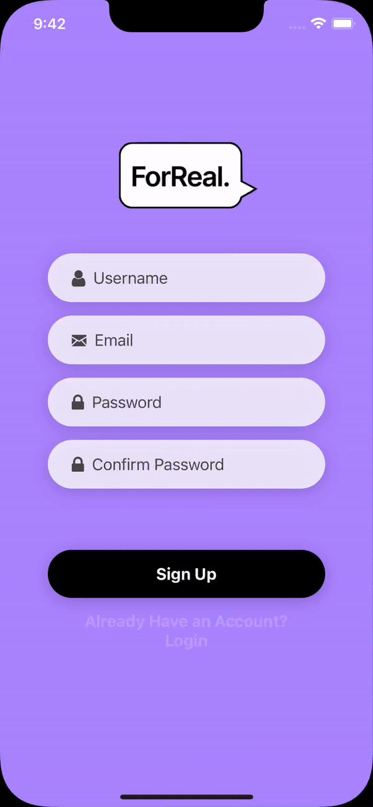

# ForReal

ForReal is a mobile application that allows users to share their thoughts on a daily prompt to the rest of the world. It’s Twitter meets Reddit meets YikYak with the daily habit stimulation of Wordle and BeReal. ForReal is different since users can only see other responses after posting their own.

Current social media has been criticized for the emergence of echo chambers and filtered realities. We hope our application can help push users to develop their own original opinions before interacting with other posts.



## Install

This project uses [node](http://nodejs.org) and [npm](https://npmjs.com). Check to see if you already have them installed by running the following command otherwise you can install them [here](https://docs.npmjs.com/downloading-and-installing-node-js-and-npm).

```
$ node -v
$ npm -v
```

For running this project, we will also need to Expo CLI. Check to see if you have it installed globally or manually install.

```
$ npm -g list # show global packages
$ npm install -g expo-cli # manually install
```

## Tech Stack

Our full-stack application is using React Native & Firebase.

1. [React Native](https://reactnative.dev/docs/getting-started) - a client-side JavaScript framework
2. [Firebase](https://firebase.google.com/docs) - serverless backend functionality

React Native allows us to deploy a dynamic client-side application for both Android and iOS. Firebase is a cloud-hosted NoSQL database that lets you store and sync data between your users in realtime. Firebase provides cross-platform SDKs to help you build and ship apps on Android, iOS and the web.

## Usage

To run locally, first clone the repository to your local device using the following command. Enter the repository and install all necessary dependencies.

```
$ git clone git@github.com:onlypham/for-real.git
$ cd for-real
$ npm install # locally install dependencies
```

Start your project via the `npm run client` command. Use app simulator by pressing `i` or download the [Expo Go](https://expo.dev/client) app on iOS to run natively on your own personal device by scanning the QR code.

## Contributors

[@AngieLue123](https://github.com/AngieLue123).
[@Georgema20](https://github.com/Georgema20).
[@onlypham](https://github.com/onlypham).
[@samuelli27](https://github.com/samuelli27).
[@tmag1](https://github.com/tmag1).